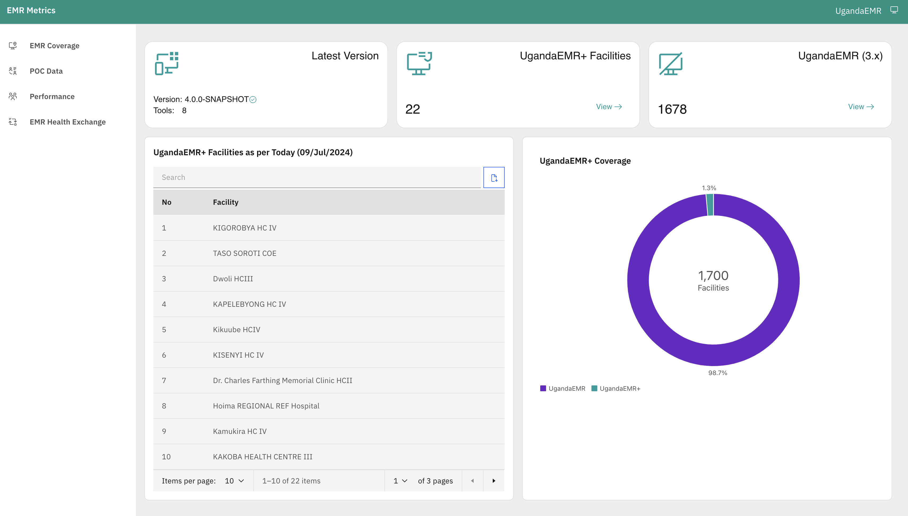

# UgandaEMR UgandaemrPOC

This dashboard shows the different metrics for different EMRs used currently at facilities

## Dashboard


## Getting Started

```sh
# Clone the repository
git clone git@github.com:METS-Programme/ugandaemr-metrics.git

# to install dependencies
npm install

# to run the dev server
npm start

#Running with specific port
npm start --port 8000


Runs the app in the development mode.\
Open [http://localhost:3000](http://localhost:3000) to view it in your browser.


The page will reload when you make changes.\
You may also see any lint errors in the console.
```


